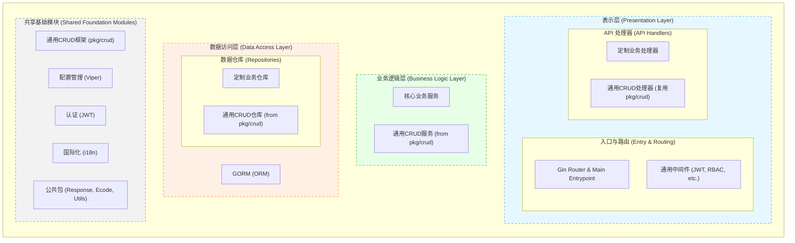

# AdminGO - 通用后台项目

## 技术选型

- 前端：React、TanStack、Shadcn
- 服务端：Gin、MySQL
- 文档搭建：  fumadocs（暂定

## 功能规划

- **MVP**
    - 服务端：用户权限；菜单；日志；文件上传；基础CRUD；多账号-邮箱验证码登录
    - 前端：后台管理模板（列表、表格、表单、状态页）
- **1.0.0 内容管理基础模块**
- **2.0.0 电商管理基础模块**
